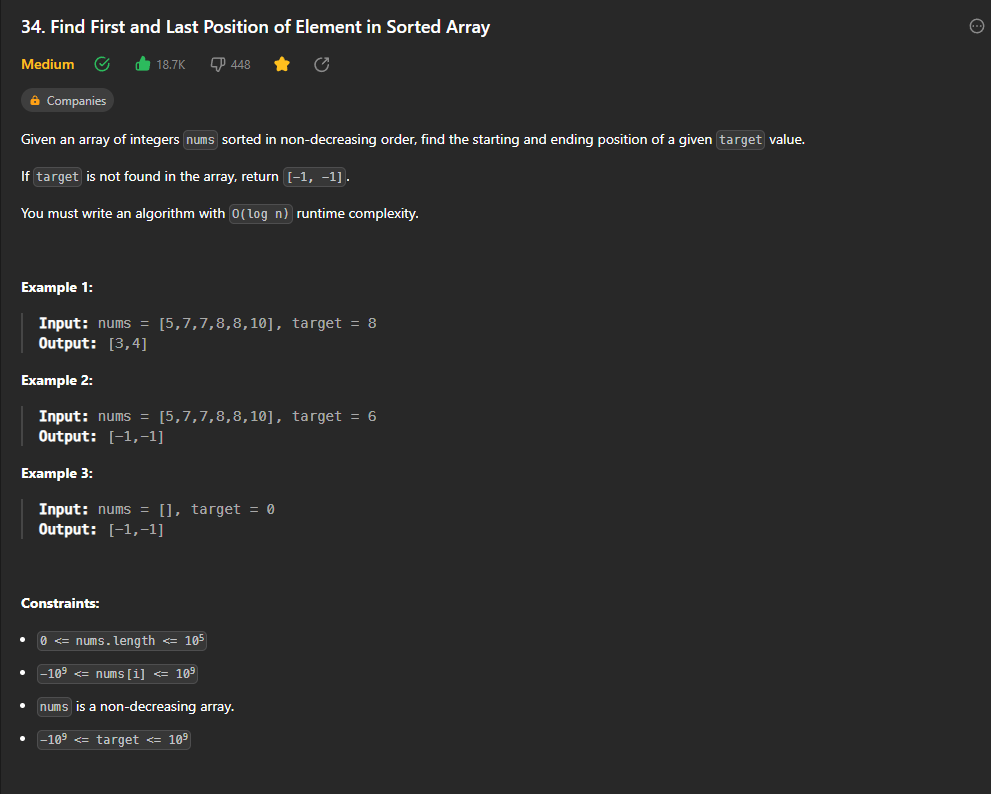

## Find First and Last Position of Element in Sorted Array


### Approach

*  Use binary search with a small tweak.
*  Two search operations will be required, one for the left side and one for the right side.
*  In the left side if we find the target, store that in the result and move left , because there can be a possibility of another target element in the left side.
*  In the right side if we find the target, store that in the result and move right , because there can be a possibility of another target element in the right side.


Code : 

```cpp
class Solution {
public:
    
    int binarysearch(vector<int> &nums ,int target){
        int start = 0 ;
        int end = nums.size() - 1 ;
        int result = -1 ;
        
        while(start <= end){
            int mid = start + (end -start) /2 ;
            
            if(nums[mid] == target){
                // you found an answer , now store it
                result = mid ;
                // and move towards left
                end = mid - 1 ;
            }
            else if(target  < nums[mid]){
                end = mid - 1 ;
            }
            else{
               start = mid + 1 ; 
            }
        }
        return result ;
    } 
    
    
     int binarysearch2(vector<int> &nums ,int target){
        int start = 0 ;
        int end = nums.size() - 1 ;
        int result = -1 ;
        
        while(start <= end){
            int mid = start + (end -start) /2 ;
            
            if(nums[mid] == target){
                // you found an answer not store it
                result = mid ;
                // and move towards right
                start = mid + 1 ;
            }
            else if(target  < nums[mid]){
                end = mid - 1 ;
            }
            else{
                start = mid + 1 ; 
            }
        }
         return result ;
    } 
    
    vector<int> searchRange(vector<int>& nums, int target) {
        
        int first = binarysearch(nums,target) ;
        int last = binarysearch2(nums,target) ;
        
        vector<int> out ;
        out.push_back(first) ;
        out.push_back(last) ;
        
        return out ;
         
    }
};

// Time Complexity : O(log n) + O(log n) = O(log n)
// Space Complexity : O(N) for the output vector  

```