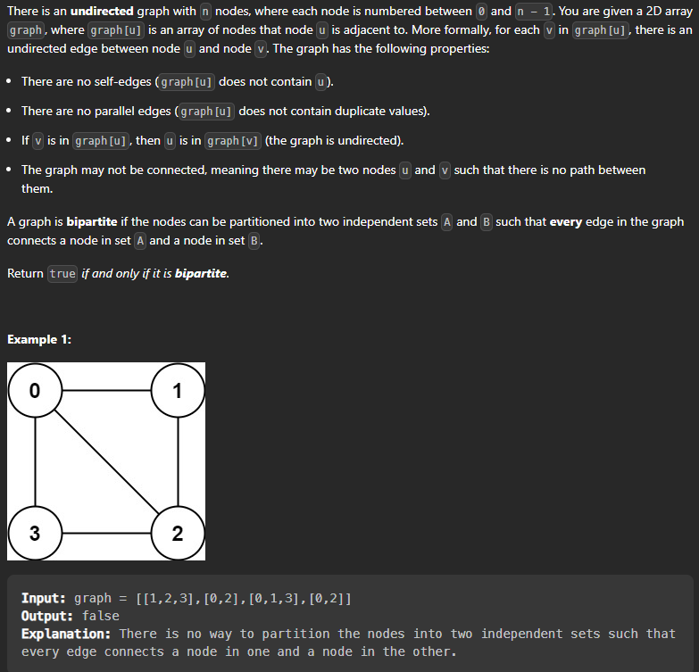

# Bipartite Graph

> Statement : There is an undirected graph with n nodes where each node is numbered from 0 to n-1.
> A graph is bipartite if the nodes can be partitioned into two independent sets A and B such that every edge in the graph connects a node in set A and a node in set B. 

> Return true if and only if it is bipartite.




> This is a graph problem. Lets look at how to appraoch this question: 
    
```
The simple concept is that a graph can only be bipartite if it is 2-colorable. 
Means that we can color the graph with 2 colors such that no two adjacent nodes have the same color. And this can only happen if the graph doesnt contain a cycle of odd length.

> If it contains a cycle of even length then we can color the graph with 2 colors.
> If it contains a cycle of odd length then we cannot color the graph with 2 colors.

Lets now see how can we insure that the graph is 2 colorable. Lets say that we have colored a graph and then we move to the next node. Now if we have to color the next node then we will check if it is already colored or not. If not then we will color that node with different color than the current color. And if it is already colored then we will check if the color is same as the current color or not. If it is same then we will return false else we will continue.

``` 

> Lets look at the dfs code first : 


```cpp

    class Solution {

        bool dfs(vector<vector<int>>& graph, vector<int>& color, int node, int c) {
            if(color[node] != -1) {
                return color[node] == c;
            }
            color[node] = c;
            for(auto x : graph[node]) {
                if(!dfs(graph, color, x, 1-c)) {
                    return false;
                }
            }
            return true;
        }

    public:
        bool isBipartite(vector<vector<int>>& graph) {
            int n = graph.size();
            vector<int> color(n, -1);
            for(int i = 0; i < n; i++) {
                if(color[i] == -1) {
                    if(!dfs(graph, color, i, 0)) {
                        return false;
                    }
                }
            }
            return true;
        }
    };

```

> Lets look at bfs appraoch now : 


```cpp

    class Solution {
    public:
        bool isBipartite(vector<vector<int>>& graph) {
            int n = graph.size();
            vector<int> color(n, -1);
            for(int i = 0; i < n; i++) {
                if(color[i] == -1) {
                    queue<int> q;
                    q.push(i);
                    color[i] = 0;
                    while(!q.empty()) {
                        int node = q.front();
                        q.pop();
                        for(auto x : graph[node]) {
                            if(color[x] == -1) {
                                color[x] = 1 - color[node];
                                q.push(x);
                            } else if(color[x] == color[node]) {
                                return false;
                            }
                        }
                    }
                }
            }
            return true;
        }
    };

```

One another bfs code : 


```cpp
class Solution {
public:
  
  bool checkBipartite(int n , vector<int> &visited , vector<vector<int>> &graph){
    visited[n] = 1 ;
    queue<int>  q ;
    q.push(n); 
    
    while(!q.empty()){
      int top = q.front() ;
      q.pop() ;   
      for(auto it : graph[top]){
          // adjancent node not visited -> change the color 
        if(visited[it] == -1) {
          visited[it] = 1 -  visited[top] ;
            // push that in the queue
          q.push(it);
        }
        // visited and same color then contains a cycle
          else if(visited[it] == visited[top])
        {
          return false ;
        }
      }
    }
     return true ; 
  }
    bool isBipartite(vector<vector<int>>& graph) {
      int n = graph.size() ;
        vector<int> visited(n,-1) ;
      
        for(int i= 0 ; i< n ;i++){
          if(visited[i] == -1){
            if(!checkBipartite(i,visited,graph)) return false ;
          }
        }
      return true ;
    }
  
  
};

```