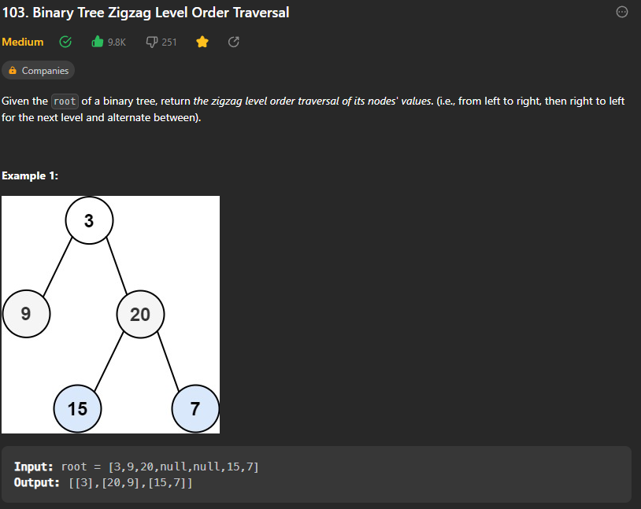

## Binary Tree ZigZag Traversal




* In this we have to print the nodes of the tree in zig zag manner
* This is same as level order traversal but we have to print the nodes of the tree in zig zag manner
* We can follow the level order traversal , but just keep in mind one thing that when the level changes make sure that we reverse the order of traversal for each level.

> Code for the question

```cpp
class Solution {
public:
    vector<vector<int>> zigzagLevelOrder(TreeNode* root) {
    vector<vector<int>> ans;
    if (root == nullptr) return ans;

    queue<TreeNode*> q;
    q.push(root);
    bool leftToRight = true;

    while (!q.empty()) {
        int size = q.size();
        vector<int> level;

        for (int i = 0; i < size; i++) {
            TreeNode* front = q.front();
            q.pop();

            if (leftToRight) {
                level.push_back(front->val);
            } else {
                level.insert(level.begin(), front->val);
            }

            if (front->left) {
                q.push(front->left);
            }
            if (front->right) {
                q.push(front->right);
            }
        }

        ans.push_back(level);
        leftToRight = !leftToRight; // Toggle the direction for the next level
    }

    return ans;
    }

};

```
