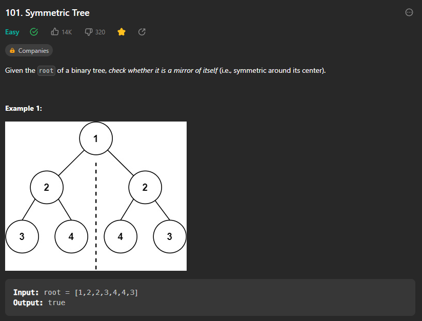

## Symmetric Tree



> What is a symmetric tree? 

* A tree is said to be symmetric if the left subtree is a mirror image of the right subtree.

> How to check if a tree is symmetric?

* We can do this by checking if the left node is equal to the right node and the left subtree is a mirror image of the right subtree.

Dfs code : 

```cpp

class Solution {
public:
    bool isSymmetric(TreeNode* root) {
        if(root==nullptr)return false;
        return test(root->left,root->right);
    }

    bool test(TreeNode *left,Tre    eNode *right){
        if(left==nullptr or right==nullptr)return false;
        // if the left node is not equal to the right node then return false
        if(left->val!=right->val)return false;
        return test(left->left,right->right) and test(left->right,right->left);
    }
};

```

> Time Complexity : O(n) 
> Space Complexity : O(n) for worst case , in case of balanced tree it is O(log N)

