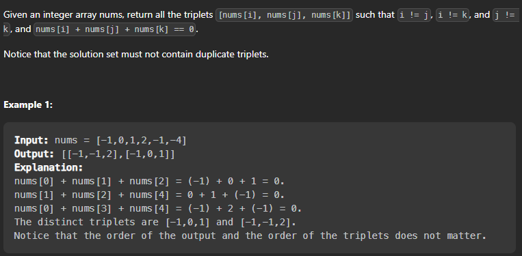

### 3sum

> Given an array nums of n integers, are there elements a, b, c in nums such that a + b + c = 0?



Let's do brute force 👍

```cpp
class Solution {
public:
    vector<vector<int>> threeSum(vector<int>& nums) {
        vector<vector<int>> res;
        for(int i=0;i<nums.size();i++){
            for(int j=i+1;j<nums.size();j++){
                for(int k=j+1;k<nums.size();k++){
                    if(nums[i]+nums[j]+nums[k]==0){
                        vector<int> temp;
                        temp.push_back(nums[i]);
                        temp.push_back(nums[j]);
                        temp.push_back(nums[k]);
                        sort(temp.begin(),temp.end());
                        //check if the vector is already present in the result
                        //if not then push it
                        if(find(res.begin(),res.end(),temp)==res.end())
                            res.push_back(temp);
                    }
                }
            }
        }
        return res;
    }
};
```

Time Complexity: O(n^3)
Space Complexity: O(n)

Let's do better than this 👍

```cpp
class Solution {
public:
    vector<vector<int>> threeSum(vector<int>& nums) {
        vector<vector<int>> res;
        sort(nums.begin(),nums.end());
        for(int i=0;i<nums.size();i++){
            if((i > 0 )and( nums[i] == nums[i-1])) continue; // skip duplicates in the outer loop itself
            int front=i+1;
            int back=nums.size()-1;
            while(front<back){
                int sum=nums[front]+nums[back] + nums[i]; // the triplets
                if(sum<0)
                    front++;
                else if(sum>0)
                    back--;
                else{
                    res.push_back(vector<int> {nums[i], nums[front], nums[back]}); // in case we find the triplets
                    while(front < back and nums[front]== nums[front+1]) front++; // remove duplicates in the middle
                    while(front < back and nums[back]==nums[back-1]) back--;
                    front++; // move to next potential triplets
                    back--;
                }
            }
        }
        return res;
    }
};


int main() {
    Solution solution;
    vector<int> nums = {-1, 0, 1, 2, -1, -4};
    vector<vector<int>> result = solution.threeSum(nums);

    cout << "Unique triplets that sum up to zero:" << endl;
    for (const auto& triplet : result) {
        for (int num : triplet) {
            cout << num << " ";
        }
        cout << endl;
    }

    return 0;
}

```

Time Complexity: O(n^2)
Space Complexity: O(n)


