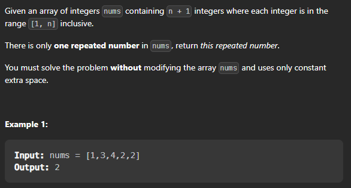

## Find the Duplicate Number

#### Problem link : [Duplicate Number](https://leetcode.com/problems/find-the-duplicate-number/)




1. Lets discuss the brute force approach first. We can use two loops and check for every element if there is a duplicate element in the array. If we find a duplicate element we can return it. This approach will take O(n^2) time and O(1) space.

2. Another approach is that we can sort the array and then check for the adjacent elements if they are equal or not. This approach will take O(nlogn) time and O(1) space.

3. We can use a hash table to store the elements of the array and then check if the element is already present in the hash table or not. If it is present then we can return it. This approach will take O(n) time and O(n) space.

4. One more way to solve this problem is to use the array elements as indexes and mark the elements as negative. If we find a negative element then we can return it. This approach will take O(n) time and O(1) space.


Let's code each of the appraoches:

> Brute Force Approach

```cpp

// Brute Force Approach
int findDuplicate(vector<int>& nums) {
    int n = nums.size();
    for(int i=0;i<n;i++){
        for(int j=i+1;j<n;j++){
            if(nums[i]==nums[j]){
                return nums[i];
            }
        }
    }
    return -1;
}

```

> Sorting Approach

```cpp

// Sorting Approach
int findDuplicate(vector<int>& nums) {
    int n = nums.size();
    sort(nums.begin(),nums.end());
    for(int i=0;i<n-1;i++){
        if(nums[i]==nums[i+1]){
            return nums[i];
        }
    }
    return -1;
}

```
> Hash Table Approach

```cpp

// Hash Table Approach
int findDuplicate(vector<int>& nums) {
    int n = nums.size();
    unordered_set<int> s;
    for(int i=0;i<n;i++){
        if(s.find(nums[i])!=s.end()){
            return nums[i];
        }
        s.insert(nums[i]);
    }
    return -1;
}

```

> Using Array Indexes

Let's explain this approach. We will use the array elements as indexes and mark the elements as negative. If we find a negative element then we can return it. This approach will take O(n) time and O(1) space.

```cpp

// Using Array Indexes
int findDuplicate(vector<int>& nums) {
    int n = nums.size();
    for(int i=0;i<n;i++){
        int index = abs(nums[i]);
        if(nums[index]<0){
            return index;
        }
        nums[index] = -nums[index];
    }
    return -1;
}

```

> Using slow and fast pointers

```cpp

