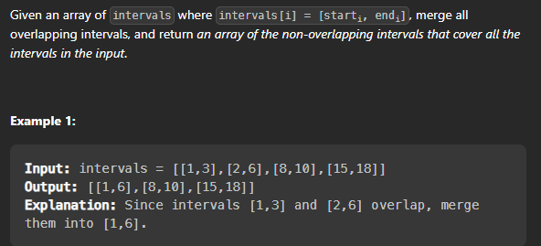

## MergeIntervals

### Question
Given a collection of intervals, merge all overlapping intervals.



### Example
```
Input: [[1,3],[2,6],[8,10],[15,18]]
Output: [[1,6],[8,10],[15,18]]
```

Problem Link : [Merge Intervals](https://leetcode.com/problems/merge-intervals/)


Let's discuss what this problem demands : 

* We are given a collection of intervals, we need to merge all overlapping intervals.

* We need to return a new collection of intervals after merging all overlapping intervals.

Now how can we merge the intervals?

* We can merge the intervals if the start time of the next interval is less than or equal to the end time of the previous interval.


Let's discuss the brute force approach first :

Steps to solve : 

* Sort the intervals based on the start time.
* Create a new vector of intervals.
* Push the first interval into the new vector. 
* Iterate over the intervals and check if the start time of the current interval is less than or equal to the end time of the previous interval, if yes then merge the intervals and update the end time of the previous interval to the maximum of the end time of both the intervals.

Let's write the code for this approach : 

```cpp

class Solution{
public:
    vector<vector<int>> merge(vector<vector<int>>& intervals) {
        // Sort the intervals based on the start time
        sort(intervals.begin(), intervals.end());
        vector<vector<int>> res;
        res.push_back(intervals[0]);
        for(int i = 1; i < intervals.size(); i++){
            // If the start time of the current interval is less than or equal to the end time of the previous interval, merge the intervals and update the end time of the previous interval to the maximum of the end time of both the intervals.
            if(intervals[i][0] <= res.back()[1]){
                res.back()[1] = max(res.back()[1], intervals[i][1]);
            }
            // else push the current interval into the new vector
            else{
                res.push_back(intervals[i]);
            }
        }
        return res;
    }
};

```

Time Complexity : O(nlogn) + O(n) = O(nlogn)
Space Complexity : O(n) -> for the new vector

Let's look at another approach :

* We can also solve this problem using stack.
* Sort the intervals based on the start time.
* Push the first interval into the stack. 
* Iterate over the intervals and check if the start time of the current interval is less than or equal to the end time of the top of the stack, if yes then merge the intervals and update the end time of the top of the stack to the maximum of the end time of both the intervals.

Let's write the code for this approach : 

```cpp

class Solution{ 
public:
    vector<vector<int>> merge(vector<vector<int>>& intervals) {
        // Sort the intervals based on the start time
        sort(intervals.begin(), intervals.end());
        stack<vector<int>> s;
        s.push(intervals[0]);
        for(int i = 1; i < intervals.size(); i++){
            // If the start time of the current interval is less than or equal to the end time of the top of the stack, merge the intervals
            if(intervals[i][0] <= s.top()[1]){
                s.top()[1] = max(s.top()[1], intervals[i][1]);
            }
            // else push the current interval into the stack
            else{
                s.push(intervals[i]);
            }
        }
        vector<vector<int>> res;
        while(!s.empty()){
            res.push_back(s.top());
            s.pop();
        }
        reverse(res.begin(), res.end());
        return res;
    }
};

```
