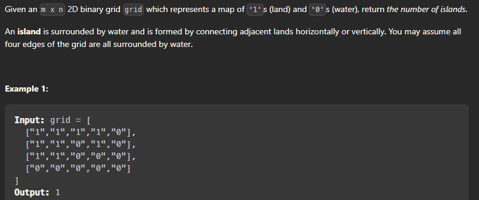

# Number of Islands(Leetcode #200)

* Question Link :  [Number of Islands](https://leetcode.com/problems/number-of-islands/)


* Question Description :
```Given an m x n 2D binary grid grid which represents a map of '1's (land) and '0's (water), return the number of islands.```



> Approach : So this question is simple. All we have to do is that find a grid with value 1 and do a dfs call on it . And in the dfs call mark all the adjacent 1's with 2 and then move in 4 directions. And count all the number of dfs calls we made. Thats it.


Lets write dfs code first : 

```cpp

    class Solution {
        
        void dfs(vector<vector<char>>& grid, int i, int j) {
            if(i < 0 || j < 0 || i >= grid.size() || j >= grid[0].size() || grid[i][j] != '1') {
                return;
            }
            grid[i][j] = '2';
            dfs(grid, i+1, j);
            dfs(grid, i-1, j);
            dfs(grid, i, j+1);
            dfs(grid, i, j-1);
        }
        
    public:
        int numIslands(vector<vector<char>>& grid) {
            int n = grid.size();
            int m = grid[0].size();
            int count = 0;
            for(int i = 0; i < n; i++) {
                for(int j = 0; j < m; j++) {
                    if(grid[i][j] == '1') {
                        dfs(grid, i, j);
                        count++;
                    }
                }
            }
            return count;
        }
    };

```


>>Time Complexity : O(n*m) where n is the number of rows and m is the number of columns.

>> Space Complexity : O(n*m) where n is the number of rows and m is the number of columns.

Now lets look at bfs code: 

```cpp

    class Solution {
        public: 

            int numIslands(vector<vector<char>> &grid){ 
                int n = grid.size();
                int m = grid[0].size();
                int count = 0;
                vector<vector<int>> dir = {{1,0},{-1,0},{0,1},{0,-1}};
                for(int i = 0; i < n; i++){
                    for(int j = 0; j < m; j++){
                        if(grid[i][j] == '1'){
                            count++;
                            queue<pair<int,int>> q;
                            q.push({i,j});
                            grid[i][j] = '2';
                            while(!q.empty()){
                                pair<int,int> p = q.front();
                                q.pop();
                                for(int k = 0; k < 4; k++){
                                    int x = p.first + dir[k][0];
                                    int y = p.second + dir[k][1];
                                    if(x >= 0 && y >= 0 && x < n && y < m && grid[x][y] == '1'){
                                        q.push({x,y});
                                        grid[x][y] = '2';
                                    }
                                }
                            }
                        }
                    }
                }
                return count;
            }
    };

```