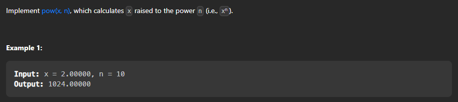

## Pow(x,n)



Problem link : [Pow(x,n)](https://leetcode.com/problems/powx-n/)

Let's understand this question first : 

We have to find the value of x^n. We can do this by multiplying x n times. But this will take O(n) time. We can optimize this solution by using divide and conquer approach. We can divide the power by 2 and multiply the result with itself. We can repeat this process until we reach the power 0.

Lets do brute force to solve this :

Intuition :  We can simply multiply x n times to get the result.

Time Complexity : O(n) where n is the power.
Space Complexity : O(1) 

```cpp

class Solution {
public:
    double myPow(double x, int n) {
        double ans = 1;
        for(int i = 0 ; i < abs(n) ; i++){
            ans = ans * x;
        }
        if(n < 0){
            return 1/ans;
        }
        return ans;
    }
};

```

Now let's try to optimize this solution :

```Intuition :  We can divide the power by 2 and multiply the result with itself. We can repeat this process until we reach the power 0. This will reduce the time complexity to O(logn). This works because x^n = x^(n/2) * x^(n/2) if n is even and x^n = x^(n/2) * x^(n/2) * x if n is odd.```


Let's understand this with an example :

x = 2 and n = 10  
o/p : 1024

Remember the power can be negative also. So we have to handle that case also.


Let's code this : 

```cpp

class Solution {
public:
    double myPow(double x, int n) {
        if(n == 0){
            return 1;
        }
        double temp = myPow(x,n/2);
        // if n is even
        if(n % 2 == 0){
            // if n is positive then return temp * temp
            return temp * temp;
        }
        else{
            if(n > 0){
                // if n is positive then return x * temp * temp -> because n is odd
                return x * temp * temp;
            }
            else{
                return (temp * temp)/x;
            }
        }
    }
};

```

Let's dry run with an example:

x = 2 and n = 10

```cpp

myPow(2,10) = myPow(2,5) * myPow(2,5)
myPow(2,5) = 2 * myPow(2,2) * myPow(2,2)
myPow(2,2) = myPow(2,1) * myPow(2,1)
myPow(2,1) = 2 * myPow(2,0) * myPow(2,0)
myPow(2,0) = 1

```

So the final answer will be : 

```cpp

myPow(2,10) = 2 * 
                myPow(2,5) * 
                myPow(2,5) = 2 * 
                                2 * 
                                myPow(2,2) * 
                                myPow(2,2) = 2 * 
                                            2 * 
                                            2 * 
                                            myPow(2,1) * 
                                            myPow(2,1) = 2 * 
                                                            2 * 
                                                            2 * 
                                                            2 * 
                                                            2 * 
                                                            myPow(2,0) * 
                                                            myPow(2,0) = 2 * 
                                                                        2 * 
                                                                        2 * 
                                                                        2 * 
                                                                        2 * 
                                                                        1 * 
                                                                        1 = 1024
    
    ```

Time Complexity : O(logn) where n is the power.
Space Complexity : O(logn)

## Pow(x,n) - Iterative Solution

```cpp

class Solution {
public:
    double myPow(double x, int n) {
        double ans = 1;
        long long int nn = n;
        if(nn < 0){
            nn = -1 * nn;
        }
        while(nn > 0){
            if(nn % 2 == 0){
                x = x * x;
                nn = nn / 2;
            }
            else{
                ans = ans * x;
                nn = nn - 1;
            }
        }
        if(n < 0){
            return 1/ans;
        }
        return ans;
    }
};

```

Time Complexity : O(logn) where n is the power.
Space Complexity : O(1)

Let's dry run with an example:

x = 2 and n = 10

```cpp

myPow(2,10);
ans = 1
nn = 10
nn % 2 == 0
x = 2 * 2 = 4
nn = 10 / 2 = 5

nn > 0
nn % 2 == 1
ans = 1 * 4 = 4
nn = 5 - 1 = 4

nn > 0
nn % 2 == 0
x = 4 * 4 = 16
nn = 4 / 2 = 2

nn > 0
nn % 2 == 0
x = 16 * 16 = 256
nn = 2 / 2 = 1

nn > 0
nn % 2 == 1
ans = 4 * 256 = 1024
nn = 1 - 1 = 0

nn == 0
return ans = 1024

```