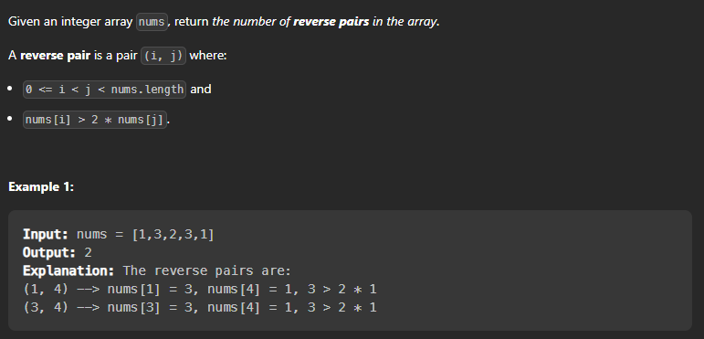

## Reverse Pairs 

### Question Description

Given an array nums, we call (i, j) an important reverse pair if i < j and nums[i] > 2*nums[j].

You need to return the number of important reverse pairs in the given array.




Let's see what the question is asking us to do:

```
We need to find the number of pairs (i,j) such that i < j and nums[i] > 2*nums[j]
```

Brute force approach:

```
We can use two loops and check for each pair if it is satisfying the condition or not.
```

Time Complexity : O(n^2) where n is the size of the array.
Space Complexity : O(1)

```cpp
class Solution {
public:
    int reversePairs(vector<int>& nums) {
        int n = nums.size();
        int count = 0;
        for(int i = 0 ; i < n ; i++){
            for(int j = i+1 ; j < n ; j++){
                if(nums[i] > 2*nums[j]){
                    count++;
                }
            }
        }
        return count;
    }
};
```

```
Other ways to solve this :

1.  Use merge sort to solve this problem.
2.  Use binary search tree to solve this problem.
```

Let's see how merge sort can be used to solve this problem:

Intuition :  We can use merge sort to solve this problem. We can divide the array into two parts and then recursively call the function on the two parts. Then we can merge the two parts and count the number of pairs satisfying the condition.

Time Complexity : O(nlogn) where n is the size of the array.
Space Complexity : O(n)

```cpp
class Solution {
public:
    int merge(vector<int>& nums,int low,int mid,int high){
        int count = 0;
        int j = mid+1;
        for(int i = low ; i <= mid ; i++){
            while(j <= high && nums[i] > 2LL*nums[j]){
                j++;
            }
            count += (j-(mid+1));
        }
        vector<int> temp;
        int left = low;
        int right = mid+1;
        while(left <= mid && right <= high){
            if(nums[left] <= nums[right]){
                temp.push_back(nums[left++]);
            }
            else{
                temp.push_back(nums[right++]);
            }
        }
        while(left <= mid){
            temp.push_back(nums[left++]);
        }
        while(right <= high){
            temp.push_back(nums[right++]);
        }
        for(int i = low ; i <= high ; i++){
            nums[i] = temp[i-low];
        }
        return count;
    }
    int mergeSort(vector<int>& nums,int low,int high){
        if(low >= high){
            return 0;
        }
        int mid = (low+high)/2;
        int inv = mergeSort(nums,low,mid);
        inv += mergeSort(nums,mid+1,high);
        inv += merge(nums,low,mid,high);
        return inv;
    }
    int reversePairs(vector<int>& nums) {
        return mergeSort(nums,0,nums.size()-1);
    }
};
```