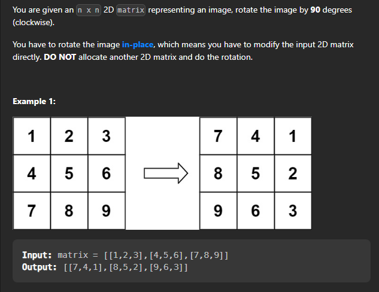

## Rotate Image 

### Problem Statement
You are given an n x n 2D matrix representing an image. Rotate the image by 90 degrees (clockwise).

> Problem link : [Rotate Image](https://leetcode.com/problems/rotate-image/)




### Solution

* Approach 1 : Brute force
    *  Create a new matrix of same size
    * Copy the elements of the original matrix to the new matrix in rotated form
     
* Approach 2: Transpose and then reverse each row
    * Transpose the matrix
    * Reverse each row


> Brute force 

```cpp

class Solution{
public:
    void rotate(vector<vector<int>>& matrix) {
        int n = matrix.size();
        vector<vector<int>> res(n, vector<int>(n, 0));
        for(int i = 0; i < n; i++){
            for(int j = 0; j < n; j++){
                res[j][n - i - 1] = matrix[i][j];
            }
        }
        matrix = res;
    }
};

```

Time Complexity : O(n^2)
Space Complexity : O(n^2)

>  Now lets look at another approach

> Approach : Transpose and then reverse each row , In this approach we will first transpose the matrix and then reverse each row of the matrix. 

The logic behind this approach is that if we transpose the matrix and then reverse each row, it will be equivalent to rotating the matrix by 90 degrees. By transpose we mean, we will change the rows to columns and columns to rows.

Lets write the code for this method : 

```cpp

class Solution{
public:
    void rotate(vector<vector<int>>& matrix) {
        int n = matrix.size();
        for(int i = 0; i < n; i++){
            for(int j = i; j < n; j++){
                // transposing the matrix 
                // make rows as columns and columns as rows
                // by swapping the elements
                swap(matrix[i][j], matrix[j][i]);
            }
        }
        for(int i = 0; i < n; i++){
            reverse(matrix[i].begin(), matrix[i].end());
        }
    }
};

```

Time Complexity : O(n^2)
Space Complexity : O(1) -> Inplace


