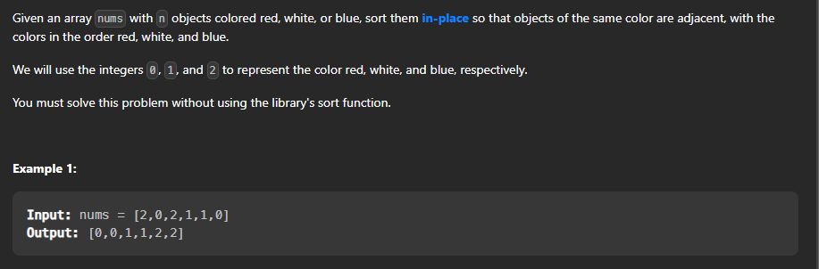

## Sort Colors

Problem link : [Sort Colors](https://leetcode.com/problems/sort-colors/)



Lets talk about the approach to solve this problem.

### Approach
1 . Brute force approach : In this approach we will simply sort the array and then we will return the sorted array.

2 . Counting Sort : In this approach we will count the number of 0's , 1's and 2's and then we will fill the array with 0's , 1's and 2's.

3 . Dutch National Flag Algorithm : In this approach we will use three pointers low , mid and high. low will point to the first element of the array , mid will point to the first element of the array and high will point to the last element of the array. We will iterate over the array and if we encounter 0 then we will swap it with the element at mid and we will increment both low and mid. If we encounter 1 then we will simply increment mid and if we encounter 2 then we will swap it with the element at high and we will decrement high.

### Brute Force Approach

```cpp

class Solution {

public:

    void sortColors(vector<int>& nums) {

        // base case

        if(nums.size() == 1){

            return;

        }

        sort(nums.begin(),nums.end());

    }

};

```

### Counting Sort

```cpp

class Solution {
public:
    void sortColors(vector<int>& nums) {
       if(nums.size() == 1){
            return;
        }
        int count_0 = 0;
        int count_1 = 0;
        int count_2 = 0;

        for(int i = 0 ; i < nums.size() ; i++){
            if(nums[i] == 0){
                count_0++;
            }
            else if(nums[i] == 1){
                count_1++;
            }
            else{
                count_2++;
            }
        }
        // filling the array with 0's , 1's and 2's
        for(int i = 0 ; i < nums.size() ; i++){
            if(count_0 > 0){
                nums[i] = 0;
                count_0--;
            }
            else if(count_1 > 0){
                nums[i] = 1;
                count_1--;
            }
            else{
                nums[i] = 2;
                count_2--;
            }
        }
    }
};
```


### Dutch National Flag Algorithm

```cpp

class Solution {
    public:
    void sortColors(vector<int>& nums) {
        if(nums.size() == 1){
            return;
        }
        int low = 0;
        int mid = 0;
        int high = nums.size() - 1;
        while(mid <= high){
            // 0's will be filled in the beginning
            if(nums[mid] == 0){
                swap(nums[low],nums[mid]);
                low++;
                mid++;
            }
            // 1's will be filled in the middle
            else if(nums[mid] == 1){
                mid++;
            }
            // 2's will be filled from last
            else{
                swap(nums[mid],nums[high]);
                high--;
            }
        }
    }
};
```