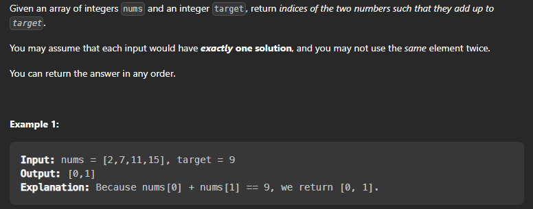

## Two Sum

Problem Statement: Given an array of integers, return indices of the two numbers such that they add up to a specific target.

You may assume that each input would have exactly one solution, and you may not use the same element twice.





```
Let's do brute force:

Intuition : For each element, we try to find if there is another element that sums up to the target.

Algorithm : For each element, we try to find if there is another element that sums up to the target.

Complexity Analysis: 
Time complexity : O(n^2). For each element, we try to find its complement by looping through the rest of array which takes O(n) time. Therefore, the time complexity is O(n^2).

Space complexity : O(1).

```

```cpp

class Solution {

public:
    vector<int> twoSum(vector<int>& nums, int target) {
        vector<int> result;
        for (int i = 0; i < nums.size(); i++) {
            for (int j = i + 1; j < nums.size(); j++) {
                if (nums[j] == target - nums[i]) {
                    result.push_back(i);
                    result.push_back(j);
                    return result;
                }
            }
        }
        return result;
    }
};

```

Let's do better:

-> Intuition : We can reduce the time complexity of looking up a value to O(1) using a hash map that maps a value to its index.


-> Algorithm : We iterate through each element in the array, and look up the complement value in the hash table. If it is found, we return the indices.

```cpp
class Solution {
    public:
        vector<int> twoSum(vector<int>& nums, int target) {
            unordered_map<int, int> hash;
            vector<int> result;
            for (int i = 0; i < nums.size(); i++) {
                int numberToFind = target - nums[i];
                //if numberToFind is found in map, return them
                if (hash.find(numberToFind) != hash.end()) {
                    //+1 because indices are NOT zero based
                    result.push_back(hash[numberToFind]); // -> push index of numbers
                    result.push_back(i);            
                    return result;
                }
                //number was not found. Put it in the map along with its index.
                hash[nums[i]] = i;
            }
            return result;
        }
}
```

```Complexity Analysis: 

Time complexity : O(n). We traverse the list containing nn elements only once. Each look up in the table costs only O(1) time.
Space complexity : O(n). The extra space required depends on the number of items stored in the hash table, which stores at most nn elements.

```


