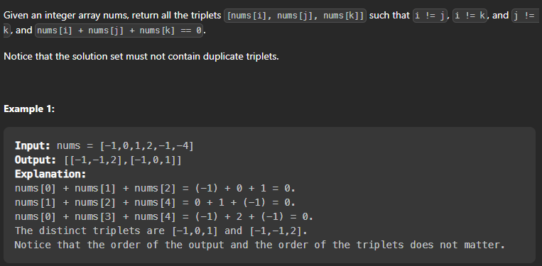

### 3sum

> Given an array nums of n integers, are there elements a, b, c in nums such that a + b + c = 0?



Let's do brute force 👍

```cpp
class Solution {
public:
    vector<vector<int>> threeSum(vector<int>& nums) {
        vector<vector<int>> res;
        for(int i=0;i<nums.size();i++){
            for(int j=i+1;j<nums.size();j++){
                for(int k=j+1;k<nums.size();k++){
                    if(nums[i]+nums[j]+nums[k]==0){
                        vector<int> temp;
                        temp.push_back(nums[i]);
                        temp.push_back(nums[j]);
                        temp.push_back(nums[k]);
                        sort(temp.begin(),temp.end());
                        //check if the vector is already present in the result
                        //if not then push it
                        if(find(res.begin(),res.end(),temp)==res.end())
                            res.push_back(temp);
                    }
                }
            }
        }
        return res;
    }
};
```

Time Complexity: O(n^3)
Space Complexity: O(n)

Let's do better than this 👍

```cpp
class Solution {
public:
    vector<vector<int>> threeSum(vector<int>& nums) {
        vector<vector<int>> res;
        sort(nums.begin(),nums.end());
        for(int i=0;i<nums.size();i++){
            int target=-nums[i];
            int front=i+1;
            int back=nums.size()-1;
            while(front<back){
                int sum=nums[front]+nums[back];
                if(sum<target)
                    front++;
                else if(sum>target)
                    back--;
                else{
                    vector<int> temp(3,0);
                    temp[0]=nums[i];
                    temp[1]=nums[front];
                    temp[2]=nums[back];
                    res.push_back(temp);
                    //processing duplicates of number 2
                    //rolling the front pointer to the next different number forwards
                    while(front<back && nums[front]==temp[1]) front++;
                    //processing duplicates of number 3
                    //rolling the back pointer to the next different number backwards
                    while(front<back && nums[back]==temp[2]) back--;
                }
            }
            //processing duplicates of number 1
            while(i+1<nums.size() && nums[i+1]==nums[i]) i++;
        }
        return res;
    }
};
```

Time Complexity: O(n^2)
Space Complexity: O(n)


