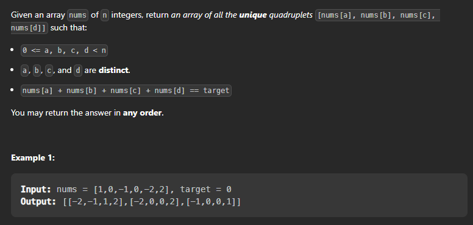

## 4 Sum

```
Problem Statement: Given an array nums of n integers and an integer target, are there elements a, b, c, and d in nums such that a + b + c + d = target? Find all unique quadruplets in the array which gives the sum of target.
```


Let's do brute force:

Intuition : For each element, we try to find if there is another element that sums up to the target. We can do this by using 2Sum algorithm. We can also use 3Sum algorithm to find 3 elements that sum up to the target. However, this will be O(n^3) time complexity.

Algorithm : For each element, we try to find if there is another element that sums up to the target. We can do this by using 2Sum algorithm. We can also use 3Sum algorithm to find 3 elements that sum up to the target. However, this will be O(n^3) time complexity.

Complexity Analysis:

Time complexity : O(n^3). For each element, we try to find its complement by looping through the rest of array which takes O(n^2) time. Therefore, the time complexity is O(n^3).

Space complexity : O(1).

```cpp

class Solution {
    public: 
        vector<vector<int>> fourSum(vector<int>& nums, int target) {
            vector<vector<int>> result;
            if (nums.size() < 4) return result;
            sort(nums.begin(), nums.end());
            for (int i = 0; i < nums.size() - 3; i++) {
                if (i > 0 && nums[i] == nums[i - 1]) continue;
                for (int j = i + 1; j < nums.size() - 2; j++) {
                    if (j > i + 1 && nums[j] == nums[j - 1]) continue;
                    int left = j + 1, right = nums.size() - 1;
                    while (left < right) {
                        int sum = nums[i] + nums[j] + nums[left] + nums[right];
                        if (sum == target) {
                            result.push_back({nums[i], nums[j], nums[left], nums[right]});
                            while (left < right && nums[left] == nums[left + 1]) left++;
                            while (left < right && nums[right] == nums[right - 1]) right--;
                            left++;
                            right--;
                        } else if (sum < target) {
                            left++;
                        } else {
                            right--;
                        }
                    }
                }
            }
            return result;
        }
};  

``` 