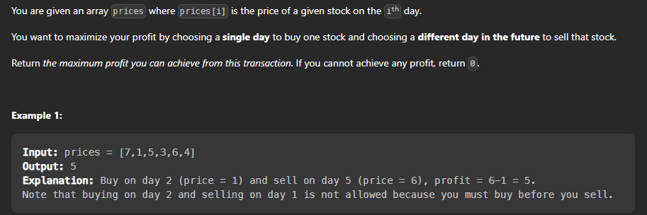

## Best Time to Buy and Sell Stocks

Problem: Given an array of stock prices, find the maximum profit that can be made by buying and selling stocks.

### Problem Statement




Lets discuss brute force first : 

Steps to solve this problem using brute force approach :

1 . Iterate over the array and for each element find the maximum element in the right part of the array.

2 . Find the difference between the maximum element and the current element.

3 . Return the maximum difference.

### Brute Force Approach

```cpp

class Solution {
    public:
        int maxProfit(vector<int>& prices) {
            // base case
            if(prices.size() == 1){
                return 0;
            }
            int max_profit = INT_MIN;
            for(int i = 0 ; i < prices.size() ; i++){
                for(int j = i + 1 ; j < prices.size() ; j++){
                    max_profit = max(max_profit,prices[j] - prices[i]);
                }
            }
            return max_profit;
        }
};
```

Time Complexity : O(n^2)
Space Complexity : O(1) -> No extra space is used.


### Optimized Approach

Lets discuss optimized approach now :

Steps to solve this problem using optimized approach :

1 . Iterate over the array and for each element find the minimum element in the left part of the array.

2 . Find the difference between the current element and the minimum element.

3 . Return the maximum difference.

### Optimized Approach

```cpp

class Solution {
    public:
        int maxProfit(vector<int>& prices) {
            // base case
            if(prices.size() == 1){
                return 0;
            }
            int max_profit = INT_MIN;
            int min_price = INT_MAX;
            for(int i = 0 ; i < prices.size() ; i++){
                min_price = min(min_price,prices[i]);
                max_profit = max(max_profit,prices[i] - min_price);
            }
            return max_profit;
        }
};
```

Time complexity of this approach : O(n) ->  because we are iterating over the array only once.
Space complexity of this approach : O(1) -> No extra space is used.