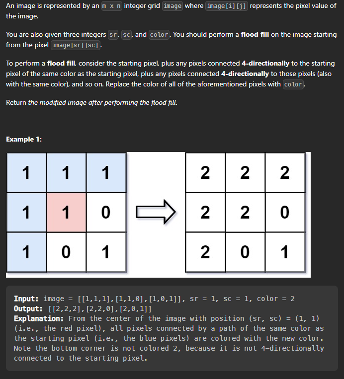

## Flood Fill

> Concepts used : 

 * BFS algo 
 * Create a queue to maintain the vertices to be visited.
 * Push the source into the queue and mark them with the required color.
 * Now visit the neighbouring nodes in 4-directions and if they do not contain the required color, then color them and push them in the queue, so that they cann further be anaylyzed and their neighbours can be colored.