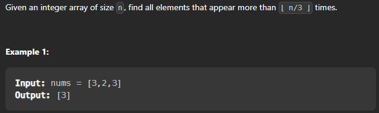

## Majority Element (Leetcode 169)

### Problem Statement

Given an array of size n, find the majority element. The majority element is the element that appears more than ⌊ n/2 ⌋ times.

You may assume that the array is non-empty and the majority element always exist in the array.

Problem link : [Majority Element](https://leetcode.com/problems/majority-element/)


Let's do brtue force to solve this :

Intuition :  We can use two loops and check if the element is appearing more than n/2 times.

Time Complexity : O(n^2) where n is the size of the array.
Space Complexity : O(1)

```cpp
class Solution {
public:
    int majorityElement(vector<int>& nums) {
        int n = nums.size();
        for(int i = 0 ; i < n ; i++){
            int count = 0;
            for(int j = 0 ; j < n ; j++){
                if(nums[i] == nums[j]){
                    count++;
                }
            }
            if(count > n/2){
                return nums[i];
            }
        }
        return -1;
    }
};
```

```
Other ways to solve this : 

1.  Use map to store the frequency of each element and then iterate over the map to find the element with frequency greater than n/2.
2.  Sort the array and return the element at n/2 index.
3.  Use Moore's Voting Algorithm.
```
let's try to optimize this solution :

Use maps now : 

Intuition :  We can use maps to store the frequency of each element and then iterate over the map to find the element with frequency greater than n/2.

Time Complexity : O(n) where n is the size of the array.
Space Complexity : O(n)

```cpp
class Solution {
public:
    int majorityElement(vector<int>& nums) {
        int n = nums.size();
        unordered_map<int,int> mp;
        for(int i = 0 ; i < n ; i++){
            mp[nums[i]]++;
        }
        for(auto it : mp){
            if(it.second > n/2){
                return it.first;
            }
        }
        return -1;
    }
};
```

Sort the array and return the element at n/2 index.
Intuition :  We can sort the array and return the element at n/2 index.

Time Complexity : O(nlogn) where n is the size of the array.
Space Complexity : O(1)

```cpp
class Solution {
public:
    int majorityElement(vector<int>& nums) {
        int n = nums.size();
        sort(nums.begin(),nums.end());
        return nums[n/2];
    }
};
```


Use Moore's Voting Algorithm.
```
Let's understand the algorithm first -> 

We can observe that if we cancel out each occurrence of an element e with all the other elements that are different from e then e will exist till end if it is a majority element.

Algorithm :

1.  Initialize index and count of majority element
    maj_index = 0, count = 1
2.  Loop for i = 1 to size – 1
    (a) If a[maj_index] == a[i]
            count++
    (b) Else
        count--;
    (c) If count == 0
            maj_index = i;
            count = 1
3.  Return a[maj_index]


```

Time Complexity : O(n) where n is the size of the array.
Space Complexity : O(1)

```cpp
class Solution {
public:
    int majorityElement(vector<int>& nums) {
        int n = nums.size();
        int count = 1;
        int maj_index = 0;
        for(int i = 1 ; i < n ; i++){
            if(nums[maj_index] == nums[i]){
                count++;
            }
            else{
                count--;
            }
            if(count == 0){
                maj_index = i;
                count = 1;
            }
        }
        return nums[maj_index];
    }
};
```


Let's dry run with an example:

```
nums = [2,2,1,1,1,2,2]
output : 2

n=7
maj_index = 0
count = 1

i=1
count = 2
maj_index = 0

i=2
count = 1
maj_index = 0                   

i=3
count = 0
maj_index = 3

i=4
count = 1
maj_index = 3

i=5
count = 2
maj_index = 3

i=6
count=1
maj_index = 3

i=7
count=0
maj_index = 7

return nums[maj_index] = 2

```

## Let's solve majority element II now :

Problem  link : [Majority Element II](https://leetcode.com/problems/majority-element-ii/)



Brute force appraoch : 

Intuition :  We can use two loops and check if the element is appearing more than n/3 times. 

Time Complexity : O(n^2) where n is the size of the array.
Space Complexity : O(1)

```cpp
class Solution {
public:
    vector<int> majorityElement(vector<int>& nums) {
        int n = nums.size();
        vector<int> ans;
        for(int i = 0 ; i < n ; i++){
            int count = 0;
            for(int j = 0 ; j < n ; j++){
                if(nums[i] == nums[j]){
                    count++;
                }
            }
            if(count > n/3){
                ans.push_back(nums[i]);
            }
        }
        return ans;
    }
};
```

```
Other ways to solve this :

1.  Use map to store the frequency of each element and then iterate over the map to find the element with frequency greater than n/3.
2.  Sort the array and return the element at n/3 index.
3.  Use Moore's Voting Algorithm.


Let's solve using maps now :

Intuition :  We can use maps to store the frequency of each element and then iterate over the map to find the element with frequency greater than n/3.

Time Complexity : O(n) where n is the size of the array.
Space Complexity : O(n)

```

```cpp

class Solution {
public:
    vector<int> majorityElement(vector<int>& nums) {
        int n = nums.size();
        unordered_map<int,int> mp;
        vector<int> ans;
        for(int i = 0 ; i < n ; i++){
            mp[nums[i]]++;
        }
        for(auto it : mp){
            if(it.second > n/3){
                ans.push_back(it.first);
            }
        }
        return ans;
    }
};
```