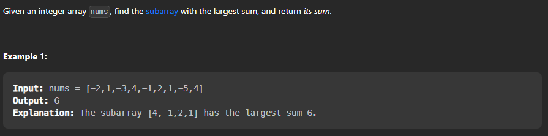

## Maximum Subarray

### Problem Statement

Given an integer array nums, find the contiguous subarray (containing at least one number) which has the largest sum and return its sum.




There are multiple ways to solve this problem : 

* Brute Force Approach : In this approach we will simply iterate over all the subarrays and then we will find the sum of all the subarrays and then we will return the maximum sum of all the subarrays.

* Kadane's Algorithm : In this approach we will iterate over the array and then we will find the maximum sum of the subarray ending at the current index and then we will return the maximum sum of all the subarrays.

* Divide and Conquer : In this approach we will divide the array into two parts and then we will find the maximum sum of the subarray in the left part , maximum sum of the subarray in the right part and the maximum sum of the subarray which crosses the middle element and then we will return the maximum of all the three.


### Brute Force Approach

```cpp

class Solution {

public:

    int maxSubArray(vector<int>& nums) {

        // base case

        if(nums.size() == 1){

            return nums[0];

        }

        int max_sum = INT_MIN;

        // iterating over all the subarrays

        for(int i = 0 ; i < nums.size() ; i++){

            int sum = 0;

            for(int j = i ; j < nums.size() ; j++){

                sum += nums[j];

                max_sum = max(max_sum,sum);

            }

        }

        return max_sum;

    }

};

```

### Kadane's Algorithm

```cpp

class Solution {
public:
    int maxSubArray(vector<int>& nums) {
        int sum=0,max_sum=INT_MIN;
        for(int i = 0 ; i < nums.size() ; i++){
            // finding the maximum sum of the subarray ending at the current index
            sum = max(nums[i],sum+nums[i]);
            // updating the maximum sum of all the subarrays
            max_sum = max(max_sum,sum);
        }
        return max_sum;
    }
};

```

### Divide and Conquer

Approach :

* Step 1 :  First we will divide the array into two parts and then we will find the maximum sum of the subarray in the left part , maximum sum of the subarray in the right part and the maximum sum of the subarray which crosses the middle element. 
* Step 2 :  Then we will return the maximum of all the three.


  

Code : 

```cpp

class Solution {
public:
    int maxSubArray(vector<int>& nums) {
        return maxSubArrayHelper(nums,0,nums.size()-1);
    }
    int maxSubArrayHelper(vector<int>& nums,int left,int right){
        // base case
        if(left == right){
            return nums[left];
        }
        // finding the middle element
        int mid = left + (right-left)/2;
        // finding the maximum sum of the subarray in the left part
        int left_sum = maxSubArrayHelper(nums,left,mid);
        // finding the maximum sum of the subarray in the right part
        int right_sum = maxSubArrayHelper(nums,mid+1,right);
        // finding the maximum sum of the subarray which crosses the middle element
        int cross_sum = maxCrossingSum(nums,left,mid,right);
        // returning the maximum of all the three
        return max(left_sum,max(right_sum,cross_sum));
    }
    int maxCrossingSum(vector<int>& nums,int left,int mid,int right){
        // finding the maximum sum of the subarray which crosses the middle element
        int sum = 0;
        int left_sum = INT_MIN;
        for(int i = mid ; i >= left ; i--){
            sum += nums[i];
            left_sum = max(left_sum,sum);
        }
        sum = 0;
        int right_sum = INT_MIN;
        for(int i = mid+1 ; i <= right ; i++){
            sum += nums[i];
            right_sum = max(right_sum,sum);
        }
        return left_sum + right_sum;
    }
};

```