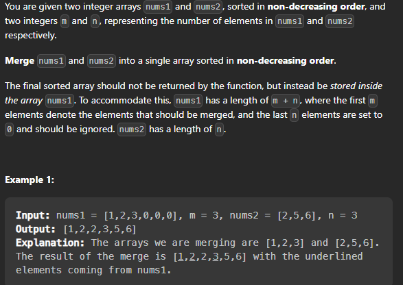

## Merge Sorted Array

Problem : [Merge Sorted Array](https://leetcode.com/problems/merge-sorted-array/)



Statement : Given two sorted integer arrays nums1 and nums2, merge nums2 into nums1 as one sorted array. 


### Example

```
Input: [1,2,3,0,0,0], m = 3, [2,5,6], n = 3
Output: [1,2,2,3,5,6]
```

Let's discuss what this problem demands :

* We are given two sorted integer arrays nums1 and nums2, we need to merge nums2 into nums1 as one sorted array. 
* The number of elements initialized in nums1 and nums2 are m and n respectively. 
* You may assume that nums1 has enough space (size that is equal to m + n) to hold additional elements from nums2. 
* We need to return the merged sorted array. 
* The array nums1 is of size m + n, where the first m elements denote the elements that should be merged, and the last n elements are set to 0 and should be ignored. 
* The array nums2 is of size n. 


Let's discuss the brute force approach first : 

Steps to solve :

* Iterate over the nums2 array and push the elements into the nums1 array.
*  Sort the nums1 array.


Let's write the code for this approach : 

```cpp

class Solution{
public:
    void merge(vector<int>& nums1, int m, vector<int>& nums2, int n) {
        for(int i = 0; i < n; i++){
            nums1[m + i] = nums2[i];
        }
        sort(nums1.begin(), nums1.end());
    }
};

```

Time Complexity : O((m + n)log(m + n))
Space Complexity : O(1)


Let's discuss the optimal approach :

Steps to solve : 

* Initialize two pointers i and j to the end of the nums1 and nums2 array respectively.
* Initialize a pointer k to the end of the nums1 array.
* Iterate over the nums1 and nums2 array from the end and compare the elements at the ith and jth index of the nums1 and nums2 array respectively.
* If the element at the ith index of the nums1 array is greater than the element at the jth index of the nums2 array, then update the kth index of the nums1 array to the element at the ith index of the nums1 array and decrement the value of i by 1. 
* Else update the kth index of the nums1 array to the element at the jth index of the nums2 array and decrement the value of j by 1. 
* Decrement the value of k by 1. 
* If the value of j becomes less than 0, then break the loop. 
* If the value of i becomes less than 0, then copy the remaining elements of the nums2 array into the nums1 array.  
* Return the nums1 array. 


Let's write the code for this approach : 

```cpp

class Solution{
public:
    void merge(vector<int>& nums1, int m, vector<int>& nums2, int n) {
        int i = m - 1, j = n - 1, k = m + n - 1;
        while(i >= 0 && j >= 0){
            if(nums1[i] > nums2[j]){
                nums1[k] = nums1[i];
                i--;
            }
            else{
                nums1[k] = nums2[j];
                j--;
            }
            k--;
        }
        while(j >= 0){
            nums1[k] = nums2[j];
            j--;
            k--;
        }
    }
};

```