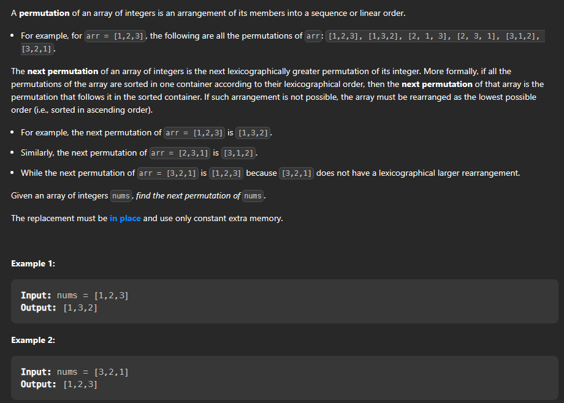

## Next Permutation



Problem Statement : [Next Permutation](https://leetcode.com/problems/next-permutation/)


Let's discuss about the problem ,  what it demands and how to approach the problem.

This is a very simple problem , we just need to observe the pattern and then we can easily solve the problem.

Methods to solve the problem :

* Step 1 :  First we need to observe the pattern of the next permutation , we can see that the next permutation is the permutation which is just greater than the current permutation.

* Step 2 :  Now we can simply iterate from the end of the array and then we can find the first element which is smaller than the element next to it and then we can swap that element with the element which is just greater than it from the end of the array.

* Step 3 :  Now we can simply reverse the array from the index of the element which is smaller than the element next to it to the end of the array.

approach:

```cpp

class Solution {

public:

    void nextPermutation(vector<int>& nums) {

        // base case
        if(nums.size() == 1){
            return;
        }

        int i = nums.size()-2;
       
        // finding the first element which is smaller than the element next to it
        // example : 1 2 3 4 5 
        //i = 3
        // here 4 is smaller than 5
        while(i >= 0 && nums[i] >= nums[i+1]){
            i--;
        }
        // if we find the element then we can swap it with the element which is just greater than it from the end of the array
        if(i >= 0){
            int j = nums.size()-1;
            // example : 1 2 3 4 5
            // here 4 is smaller than 5
            // so we will swap 4 with 5
            while(j >= 0 && nums[j] <= nums[i]){
                j--;
            }
            swap(nums[i],nums[j]);
        }
        // the array is sorted in ascending order so we can simply reverse the array from the index of the element next to i to the end of the array  
        reverse(nums.begin()+i+1,nums.end());
    }
};

```

