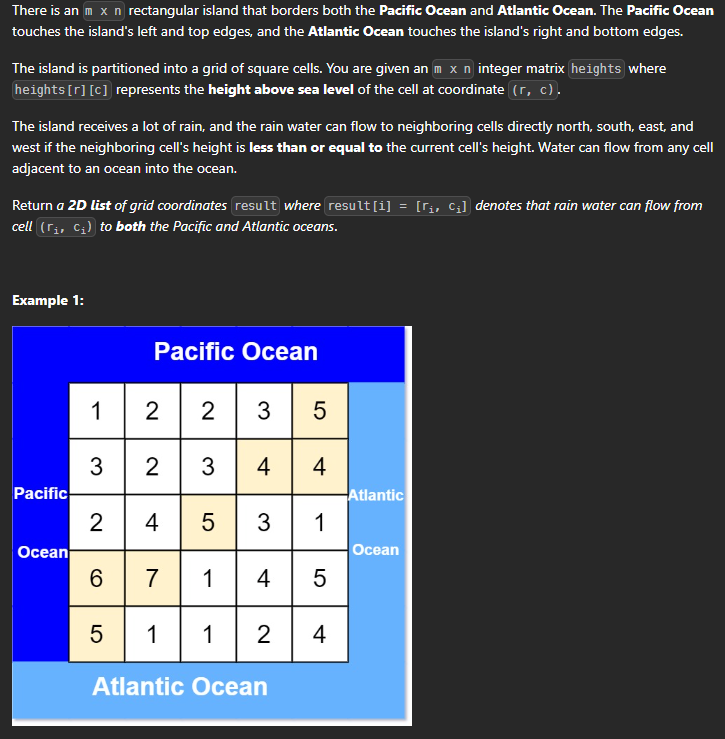

# Pacific Atlantic Water Flow

## Description



Problem Link : [Pacific Atlantic Water Flow](https://leetcode.com/problems/pacific-atlantic-water-flow/)

### Solution 

* >Approach for this : 
    * Lets first discuss how to appraoch this problem and arrive at a solution.
    * We have to return the cells which can flow to both the oceans.
    *  We can use the dfs approach to solve this problem. We will start from the cells which are on the border of the matrix. 
    *  And we will keep track of all the cells that can reach the oceans.
    *  At last the cells reaching both the oceans will be considered as the answer cells.


Lets look at bfs approach first : 

```cpp

class Solution {
public:
    vector<pair<int, int>> directions = {{-1, 0}, {0, -1}, {1, 0}, {0, 1}};
    int n, m;

    void bfs(vector<vector<int>>& heights, vector<vector<bool>>& visited, queue<pair<int, int>>& q) {
        while (!q.empty()) {
            auto [x, y] = q.front();
            q.pop();

            for (auto it : directions) {
                int nx = x + it.first;
                int ny = y + it.second;

                if (nx >= 0 && nx < n && ny >= 0 && ny < m && !visited[nx][ny] && heights[nx][ny] >= heights[x][y]) {
                    visited[nx][ny] = true;
                    q.push({nx, ny});
                }
            }
        }
    }

    vector<vector<int>> pacificAtlantic(vector<vector<int>>& heights) {
        n = heights.size();
        m = heights[0].size();
        vector<vector<int>> ans;
        vector<vector<bool>> pac(n, vector<bool>(m, false));
        vector<vector<bool>> atl(n, vector<bool>(m, false));

        queue<pair<int, int>> pq;
        queue<pair<int, int>> aq;

        // First and last row
        for (int i = 0; i < m; i++) {
            pq.push({0, i});
            aq.push({n - 1, i});
            pac[0][i] = true;
            atl[n - 1][i] = true;
        }

        // First and last column
        for (int i = 0; i < n; i++) {
            pq.push({i, 0});
            aq.push({i, m - 1});
            pac[i][0] = true;
            atl[i][m - 1] = true;
        }

        // Perform BFS for the Pacific Ocean
        bfs(heights, pac, pq);

        // Perform BFS for the Atlantic Ocean
        bfs(heights, atl, aq);

        // Find the cells reachable from both oceans
        for (int i = 0; i < n; i++) {
            for (int j = 0; j < m; j++) {
                if (pac[i][j] && atl[i][j]) {
                    ans.push_back({i, j});
                }
            }
        }

        return ans;
    }
};
```

> Time Complexity : O(n*m)
 
> Space Complexity : O(n*m)

* Lets look at dfs approach now : 


```cpp

class Solution {
    public:
        vector < pair < int, int >> directions = {{-1, 0}, {0, -1}, {1, 0}, {0, 1}};
    int n, m; 

    void dfs(vector < vector < int >> & heights, vector < vector < bool >> & visited, int x, int y) {
        visited[x][y] = true;

        for (auto it: directions) {
            int nx = x + it.first;
            int ny = y + it.second;

            if (nx >= 0 && nx < n && ny >= 0 && ny < m && !visited[nx][ny] && heights[nx][ny] >= heights[x][y]) {
                dfs(heights, visited, nx, ny);
            }
        }
    }

    vector < vector < int >> pacificAtlantic(vector < vector < int >> & heights) {
        n = heights.size();
        m = heights[0].size();
        vector < vector < int >> ans;
        vector < vector < bool >> pac(n, vector < bool > (m, false));
        vector < vector < bool >> atl(n, vector < bool > (m, false));

        // First and last row
        for (int i = 0; i < m; i++) {
            dfs(heights, pac, 0, i);
            dfs(heights, atl, n - 1, i);
        }

        // First and last column
        for (int i = 0; i < n; i++) {
            dfs(heights, pac, i, 0);
            dfs(heights, atl, i, m - 1);
        }

        // Find the cells reachable from both oceans
        for (int i = 0; i < n; i++) {
            for (int j = 0; j < m; j++) {
                if (pac[i][j] && atl[i][j]) {
                    ans.push_back({i, j});
                }
            }
        }

        return ans;
    }

};
```

> Time Complexity : O(n*m)

>  Space Complexity : O(n*m)


