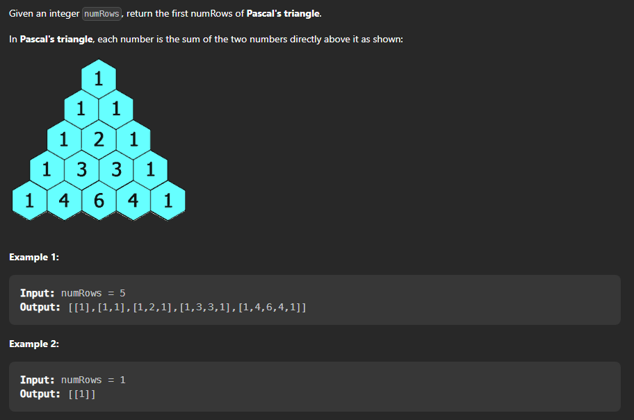

## Pascals traingle 



Problem Link : [Pascals Triangle](https://leetcode.com/problems/pascals-triangle/)

Problem statement :

Given a non-negative integer numRows, generate the first numRows of Pascal's triangle. In Pascal's triangle, each number is the sum of the two numbers directly above it. 


Let's discuss about the problem ,  what it demands and how to approach the problem.

This is a very simple problem , we just need to observe the pattern and then we can easily solve the problem.

Methods to solve the problem :

```text
Step 1 :  First we need to observe the pattern of the pascals traingle , we can see that the first and the last element of each row is 1 and the middle elements are the sum of the two elements above it.

Step 2 :  Now we can simply iterate through the rows and then iterate through the columns and then set the value of the first and the last element of each row to 1 and then for the middle elements we can simply set the value of the element to the sum of the two elements above it.

```

Recursive approach:

```cpp

class Solution {
public:
    vector<vector<int>> generate(int numRows) {
        
        // base case
        if(numRows == 0){
            return {};
        }
        if(numRows == 1){
            return {{1}};
        }
        if(numRows == 2){
            return {{1},{1,1}};
        }

        // recursive case
        vector<vector<int>> ans = generate(numRows-1);
        vector<int> temp;
        temp.push_back(1);
        for(int i = 1 ; i < numRows-1 ; i++){
            temp.push_back(ans[numRows-2][i-1] + ans[numRows-2][i]);
        }
        temp.push_back(1);
        ans.push_back(temp);
        return ans;
    }
};

```

Time Complexity : O(n^2)
Space Complexity : O(n^2)

Iterative approach: Remember just two values are important for each row , the previous row and the current row. and we can use the previous row to calculate the current row.
> Add the values of the current -1 and current position of the previous row to get the current position of the current row.

```cpp

class Solution {
    public: 

    vector<vector<int>> geneate(int rows){

        vector<vector<int>> ans;
        vector<int> temp;
        for(int i = 0 ; i < rows ; i++){
            temp.push_back(1);
            for(int j = 0 ; j < i-1 ; j++){
                temp.push_back(ans[i-1][j] + ans[i-1][j+1]);
            }   
            ans.push_back(temp);
        }
        return ans;

    }
};

```

Time Complexity : O(n^2)
Space Complexity : O(n^2)