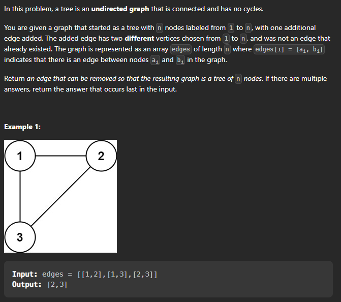

# Redundant Connection

## Problem Statement 




Problem Link : [Redundant Connection](https://leetcode.com/problems/redundant-connection/)

>> Approach to solve this question :

➡️ We see that if we have an edge that makes the graph a circle than we need to remove that edge. This is the only edge that we need to remove. 

Let's look at the bfs approach first: 

```cpp

class Solution {
    public:
  
    bool detect(int source , vector<int> &visited ,vector<vector<int>>& graph ){
            
            visited[source] = 1;        
            queue<pair<int,int>>  q ;
            
            q.push({source,-1}) ;
            
            while(!q.empty()){
                int node = q.front().first ;
                int parent = q.front().second ;
                q.pop() ;
                
            for(auto it : graph[node]){
                if(!visited[it]){
                    visited[it] = 1 ;
                    q.push({it , node}) ;
                } 
                else if(parent != it){
                    return true ;
                }
            }
                
            }
            
            return false ;
        }
        vector<int> findRedundantConnection(vector<vector<int>>& edges) {
            int n = edges.size() ;
        
            vector<vector<int>> graph(n+1) ;
            vector<int> ans ;
        
            for(auto it :  edges){
                vector<int> visited(n + 1, 0) ;
            graph[it[0]].push_back(it[1]) ;
            graph[it[1]].push_back(it[0]) ;
            // after making the graph check if the edge creates a cycle or not
                if(detect(it[0] ,visited , graph))return it  ; 
                
            }
        
        return {} ;
    }
};


```