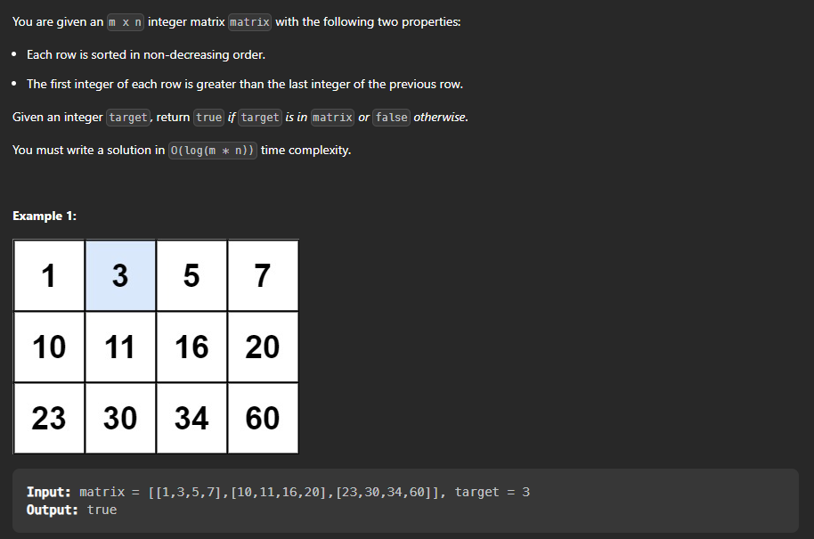

## Search In  a 2d Matrix



problem link : [Search in a 2d Matrix](https://leetcode.com/problems/search-a-2d-matrix/)


Let's do brute force to solve this : 

Intuition :  We can simply iterate over the matrix and check if the element is present or not. 

Time Complexity : O(n*m) where n is the number of rows and m is the number of columns.

Space Complexity : O(1) 

```cpp

class Solution {
public:
    bool searchMatrix(vector<vector<int>>& matrix, int target) {
        int n = matrix.size();
        int m = matrix[0].size();
        for(int i = 0 ; i < n ; i++){
            for(int j = 0 ; j < m ; j++){
                if(matrix[i][j] == target){
                    return true;
                }
            }
        }
        return false;
    }
};

```

Now let's try to optimize this solution :

Intuition :  We can observe that the matrix is sorted row wise and column wise. So we can use this property to optimize our solution.

Time Complexity : O(n+m) where n is the number of rows and m is the number of columns.

Space Complexity : O(1) 


Approach : We can start from the top right corner of the matrix and check if the element is equal to the target or not. If the element is equal to the target then we can return true. If the element is greater than the target then we can move to the left side of the matrix. If the element is less than the target then we can move to the bottom side of the matrix. We can repeat this process until we find the element or we reach the end of the matrix.

```cpp

class Solution {
public:
    bool searchMatrix(vector<vector<int>>& matrix, int target) {
        int n = matrix.size();
        int m = matrix[0].size();
        int i = 0 , j = m-1;
        while(i < n && j >= 0){
            if(matrix[i][j] == target){
                return true;
            }
            else if(matrix[i][j] > target){
                j--;
            }
            else{
                i++;
            }
        }
        return false;
    }
};

```


> Lets see another approach to solve this problem :

Intuition :  We can observe that the matrix is sorted row wise and column wise. So we can use this property to optimize our solution. 

Time Complexity : O(log(n*m)) where n is the number of rows and m is the number of columns.

Space Complexity : O(1)


Approach : We can use binary search to solve this problem. We can consider the matrix as a single array and apply binary search on it. We can use the formula to find the row and column of the element in the matrix. 

```cpp

class Solution {
public:
    bool searchMatrix(vector<vector<int>>& matrix, int target) {
        int n = matrix.size();
        int m = matrix[0].size();
        int low = 0 , high = (n*m)-1;
        while(low <= high){
            int mid = low + (high-low)/2;
            // formula to find the row and column of the element in the matrix -> row = mid/m , col = mid%m
            int row = mid/m;
            int col = mid%m;
            if(matrix[row][col] == target){
                return true;
            }
            else if(matrix[row][col] > target){
                high = mid-1;
            }
            else{
                low = mid+1;
            }
        }
        return false;
    }
};

```


```Let's take the following example :
> matrix = [[1,3,5,7],[10,11,16,20],[23,30,34,60]] , target = 3

Now let's dry run the above code :
low = 0 , high = 11 , mid = 5 
row = 5/4 = 1 , col = 5%4 = 1
matrix[1][1] = 11 which is greater than 3 so we will move to the left side of the array.

low = 0 , high = 4 , mid = 2
row = 2/4 = 0 , col = 2%4 = 2
matrix[0][2] = 5 which is greater than 3 so we will move to the left side of the array.

low = 0 , high = 1 , mid = 0
row = 0/4 = 0 , col = 0%4 = 0
matrix[0][0] = 1 which is less than 3 so we will move to the right side of the array.

low = 1 , high = 1 , mid = 1
row = 1/4 = 0 , col = 1%4 = 1
matrix[0][1] = 3 which is equal to 3 so we will return true.

```
