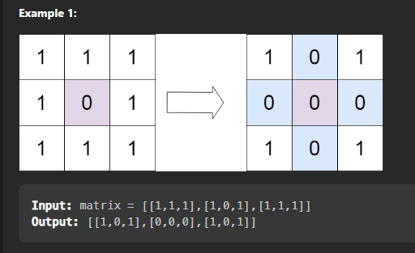

## Set matrix zero

### Question
Given a matrix, if an element is 0, set its entire row and column to 0. Do it in place.

Question Link : [Set Matrix Zero](https://leetcode.com/problems/set-matrix-zeroes/)



Let's discuss about the problem ,  what it demands and how to approach the problem.

// my approach


🎱 Step 1  : first find the place where zero lies in the matrix and store them in a set to avoid duplication of the position . Maintain two sets one for row and one for col.

🎱 Step 2 :  Now itereate through the matrix and then simply check if either the row or col any of them is present in the set , if yes then set the value of that position to zero.


Code : 

```cpp

class Solution {
    public: 
    void setZeroes(vector<vector<int>>& matrix) {
        int n = matrix.size();
        int m = matrix[0].size();
        set<int> row;
        set<int> col;
        for(int i = 0 ; i < n ; i++){
            for(int j = 0 ; j < m ; j++){
                if(matrix[i][j] == 0){
                    row.insert(i);
                    col.insert(j);
                }
            }
        }
        for(int i = 0 ; i < n ; i++){
            for(int j = 0 ; j < m ; j++){
                if(row.count(i) || col.count(j)){
                    matrix[i][j] = 0;
                }    
            }
        }
    }
};

```

* Time Complexity : O(n*m) 
* Space Complexity : O(n+m)


Another approach to optimize the space used :

>> What we can do is that instead of storing the rows and cols in a set , we can mark the row and cols in which the zero is present by setting the value of the first element of that row and col to zero.

>> Now we can iterate through the matrix and check if the first element of that row or col is zero , if yes then set the value of that position to zero.


Optimized Code : 

```cpp

class Solution {
    public: 

    void setZeroes(vector<vector<int>>& matrix) {
        int n = matrix.size();
        int m = matrix[0].size();
        bool row = false;
        bool col = false;
        for(int i = 0 ; i < n ; i++){
            for(int j = 0 ; j < m ; j++){
                if(matrix[i][j] == 0){
                    if(i == 0) row = true;
                    if(j == 0) col = true;
                    matrix[0][j] = 0;
                    matrix[i][0] = 0;
                }
            }
        }
        for(int i = 1 ; i < n ; i++){
            for(int j = 1 ; j < m ; j++){
                if(matrix[i][0] == 0 || matrix[0][j] == 0){
                    matrix[i][j] = 0;
                }
            }
        }
        if(row){
            for(int i = 0 ; i < m ; i++){
                matrix[0][i] = 0;
            }
        }
        if(col){
            for(int i = 0 ; i < n ; i++){
                matrix[i][0] = 0;
            }
        }
    }
};
// Time Complexity : O(n*m) + O(n*m)
// Space Complexity : O(1) -

```

