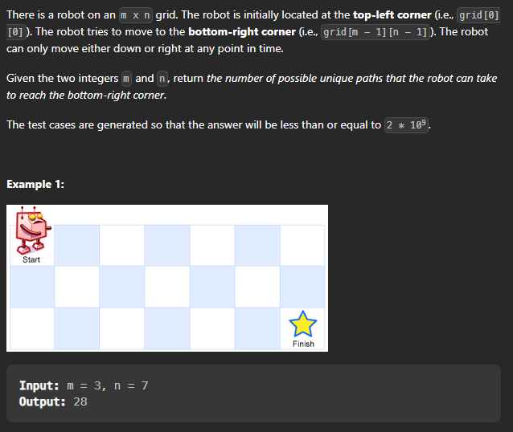

## Unique Paths(#62)

Problem Link : [Unique Paths](https://leetcode.com/problems/unique-paths/)

Problem Statement : ```A robot is located at the top-left corner of a m x n grid (marked 'Start' in the diagram below). The robot can only move either down or right at any point in time. The robot is trying to reach the bottom-right corner of the grid (marked 'Finish' in the diagram below). How many possible unique paths are there?```




Let's see what the question demands: 

```
We are required to move from top right corner to bottom left corner. And we have to find the unique paths to reach there. 

Now we can only move either down or right. So what we can do is that we can move down and right and then again down and right and so on and so forth. While doing this we have to make sure that we don't go out of the grid. And we keep the count of the unique paths.
```

Brute force method: 

``` 
We can use recursion to solve this problem.
```

```cpp
class Solution {
public:

    int uniquePathsHelper(int m, int n){
        if(m == 0 || n == 0){
            return 1;
        }
        return uniquePathsHelper(m-1,n) + uniquePathsHelper(m,n-1);
    }

    int uniquePaths(int m, int n) {
        return uniquePathsHelper(m -1,n-1);
    }
};
```

Let's see the time and space complexity of this solution: 

```
Time Complexity : O(2^(m+n)) -> Exponential
Space Complexity : O(m+n) -> Recursive stack
```

Let's see how we can optimize this solution: 

```
We can see that we are calculating the same values again and again. So we can use memoization to store the values and use them again when required.
```

```cpp
class Solution {
public:

    int uniquePathsHelper(int m, int n, vector<vector<int>>& dp){
        if(m == 0 || n == 0){
            return 1;
        }
        if(dp[m][n] != -1){
            return dp[m][n];
        }
        return dp[m][n] = uniquePathsHelper(m-1,n,dp) + uniquePathsHelper(m,n-1,dp);
    }

    int uniquePaths(int m, int n) {
        vector<vector<int>> dp(m+1,vector<int>(n+1,-1));
        return uniquePathsHelper(m -1,n-1,dp);
    }
};
```

Let's see the time and space complexity of this solution: 

```
Time Complexity : O(m*n) -> not exponential anymore as we are storing the values in dp array and using them again. 
Space Complexity : O(m*n) -> Recursive stack + dp array
```

### Tabulation Method


Let's see how we can optimize this solution further: 

```cpp

class Solution {
public:

    int uniquePaths(int m, int n) {
        vector<vector<int>> dp(m+1,vector<int>(n+1,0));
        dp[0][1] = 1;
        for(int i = 1 ; i <= m ; i++){
            for(int j = 1 ; j <= n ; j++){
                dp[i][j] = dp[i-1][j] + dp[i][j-1];
            }
        }
        return dp[m][n];
    }
};
```

Let's see the time and space complexity of this solution: 

```
Time Complexity : O(m*n) -> not exponential anymore as we are storing the values in dp array and using them again.
Space Complexity : O(m*n) -> dp array
```

### Optimized Tabulation Method

Let's see how we can optimize this solution further: 

```cpp

class Solution {
public:

    int uniquePaths(int m, int n) {
        vector<int> dp(n+1,0);
        dp[1] = 1;
        for(int i = 1 ; i <= m ; i++){
            for(int j = 1 ; j <= n ; j++){
                dp[j] = dp[j] + dp[j-1];
            }
        }
        return dp[n];
    }
};
```